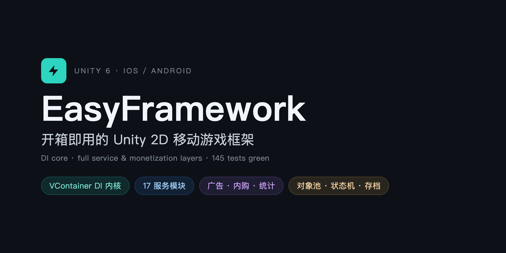

<p align="center">
  
  
  
  
  
</p>

# EasyFramework

开箱即用的 **Unity 2D 移动游戏复用底座**。用同一套框架快速做多个小游戏:做完一个,下一个直接复用。以 VContainer 依赖注入为内核,服务层全部接口化,商业化 SDK 可整体替换而不改业务代码。

> 目标:**从空项目到能跑的新游戏 < 10 分钟**(复制模板即跑)。

## 特性

- **DI 内核 + 静态门面** — VContainer 管理装配与生命周期,业务层用 `G.UI` / `G.Audio` / `G.Save` 等门面快速开发,核心逻辑仍可构造注入、可单测。
- **核心层(纯 C#,全单测)** — 异步状态机、对象池、定时器、强类型事件总线、优先级启动管线。
- **服务层(11 模块)** — 资源(Addressables 按场景自动释放)、场景过渡、存档(HMAC + 版本迁移 + 原子写)、远程配置、四层 UI 栈(弹窗带返回值)、音频交叉淡入、手势识别、相机、Juice 手感、本地化、震动。
- **商业化层(接口 + 适配器)** — 广告(频控)、内购(恢复购买 + 掉单补发)、多后端数据统计;编辑器一律 Fake 实现,真实 SDK 留 `#if` 接入槽。
- **开发体验** — 真机调试控制台、`[Cheat]` 特性作弊命令、FPS/内存角标、新游戏模板、完整示例游戏。

## 安装

要求 Unity 6000.0 或更高。全部依赖由 OpenUPM 解析,二选一:

### 方式一:OpenUPM CLI(推荐,需 Node.js)

```bash
openupm add com.yifei.easyframework
```

CLI 会自动配置 scoped registry、所有依赖 scope 和包本身。

### 方式二:手动配置

把下面这段合并进你的 `Packages/manifest.json`(已有 OpenUPM 条目则只需补全缺失的 scope):

````json
"scopedRegistries": [
  {
    "name": "OpenUPM",
    "url": "https://package.openupm.com",
    "scopes": [
      "com.yifei",
      "com.cysharp",
      "jp.hadashikick",
      "com.kyrylokuzyk",
      "com.yasirkula"
    ]
  }
]
````

然后在 Package Manager → **Add package by name** 输入 `com.yifei.easyframework`;或在收录前直接用 git URL(依赖仍由上面的 registry 解析):

```
"com.yifei.easyframework": "https://github.com/whimwindgames/EasyFramework-Unity.git?path=Packages/com.yifei.easyframework#v0.1.0"
```

安装后,在 Package Manager 里选中 EasyFramework → **Samples** 标签导入 **TapRush** 即可上手。

## 示例游戏:TapRush

包内 `Samples~/TapRush` 是用本框架做的一个完整可玩小游戏 **TapRush**(点击得分 + 60 秒倒计时 + 结算 + 看广告翻倍 + 存档最高分)——它是框架所有能力的活文档。通过 Package Manager 的 Samples 导入后,打开其 `TapRushBoot` 场景点 Play 即玩。另一个 Sample **Template** 是新游戏空白起步模板,复制改名即可作为你下一个游戏的骨架。

## 文档

- [框架使用文档](Packages/com.yifei.easyframework/README.md) — 架构、`G.Xxx` 速查表、新游戏上手指南、SDK 接入槽说明
- [设计规格](docs/superpowers/specs/2026-06-12-easyframework-design.md) — 完整设计决策
- [实现计划](docs/superpowers/plans/) — 分阶段实现细节

## 技术栈

VContainer · UniTask · MessagePipe · Addressables · Cinemachine · PrimeTween · Unity IAP · Newtonsoft Json · IngameDebugConsole
